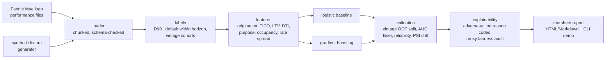

# creditlab

**Loan-level mortgage credit risk modeling on real GSE data — stress-tested through the 2008 crisis.**

Most student credit-risk projects train on toy Kaggle CSVs. creditlab trains
probability-of-default (PD) models on the public **Fannie Mae Single-Family Loan
Performance dataset** — millions of real mortgages with origination features and
month-by-month payment outcomes — and asks the question that actually matters in
credit risk: *does a model trained in good times survive a downturn?*

The flagship experiment: train on pre-2007 vintages, validate out-of-time on the
2007–2008 crisis vintages, and report exactly how calibration degrades. That is
the failure mode that broke real mortgage models in 2008, reproduced and
measured on the real data.

## Why this project

- **Real data, real scale.** Loan-level GSE data, not `german_credit.csv`.
  Chunked, memory-bounded parsing of the pipe-delimited performance files.
- **Vintage-based out-of-time validation.** Random train/test splits leak the
  macro environment. creditlab splits by origination vintage, the way model
  risk teams actually validate.
- **Calibration over accuracy.** A PD model's job is honest probabilities:
  reliability curves, Brier score, and expected-vs-realized default rates by
  decile — not just AUC.
- **Regulatory realism.** Adverse-action reason codes (top negative factors per
  applicant, ECOA-style) and a proxy-fairness audit are first-class outputs,
  not afterthoughts.
- **Offline-first.** A deterministic synthetic-fixture generator mirrors the
  Fannie Mae schema so the full test suite runs with zero downloaded data.

## Architecture



## Data access

The Fannie Mae Single-Family Loan Performance data is free but requires
registration at [Fannie Mae Data Dynamics](https://capitalmarkets.fanniemae.com/tools-applications/data-dynamics).
Nothing in this repo redistributes the data. All tests run on the bundled
synthetic fixtures; `creditlab demo` reproduces the README numbers from a
downloaded acquisition/performance file pair.

## Planned CLI

```
creditlab ingest <acq_file> <perf_file>   # parse + label + cache
creditlab train --model logit|gbm         # fit with vintage-aware split
creditlab validate --oot 2007,2008        # crisis stress validation
creditlab explain <loan_id>               # adverse-action reason codes
creditlab tearsheet                       # full HTML report
creditlab demo                            # end-to-end on synthetic data
```

## Relationship to factorlab

[factorlab](https://github.com/Arman-Chaudhury/factorlab) covers market risk
(cross-sectional factor research); creditlab covers credit risk (loan-level PD).
Same philosophy: real data, statistical honesty, walk-forward/out-of-time
validation, reproducible demo numbers.

---

> **Status: scaffolded, not complete.** This repo was scaffolded from a build spec; see `BUILD_PLAN.md` for the milestones.
