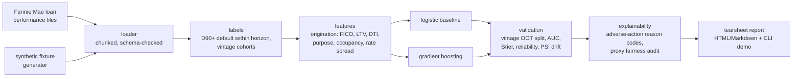

# creditlab

**Can a model that predicts which mortgages will go bad still work when the economy falls apart?**

When someone takes out a mortgage, the lender wants to know how likely that
person is to stop paying. Banks build models to estimate that, and the models
usually look great right up until a recession, when they fall apart. That is
roughly what happened in 2008.

creditlab is my attempt to test that properly. It is built for Fannie Mae's
public records of real mortgages (millions of loans, with what happened to each
one month by month). It trains a model on loans from before 2007, then checks
how well that model holds up on loans from the crisis years. The interesting
part is not that it gets worse, it is measuring exactly how: the model still
ranks risky loans above safe ones, but the actual probabilities it gives end up
way off. That gap is what broke real bank models in 2008. The numbers checked
in right now come from synthetic test data shaped like the real files; the real
download plugs straight in.

## Why this project

- **Real data, real scale.** Loan-level GSE data, not `german_credit.csv`.
  Chunked, memory-bounded parsing of the pipe-delimited performance files.
- **Vintage-based out-of-time validation.** Random train/test splits leak the
  macro environment. creditlab splits by origination vintage, the way model
  risk teams actually validate.
- **Calibration over accuracy.** A PD model's job is honest probabilities:
  reliability curves, Brier score, and expected-vs-realized default rates by
  decile — not just AUC.
- **Regulatory realism.** Adverse-action reason codes (top negative factors per
  applicant, ECOA-style) and a proxy-fairness audit are first-class outputs,
  not afterthoughts.
- **Offline-first.** A deterministic synthetic-fixture generator mirrors the
  Fannie Mae schema so the full test suite runs with zero downloaded data.

## Architecture



## The headline experiment

`creditlab.validation.crisis_validation` runs the same trainer through both
protocols — the naive random split and the honest vintage-based out-of-time
split (train ≤ 2006, validate on 2007–08 originations) — and reports them side
by side. On the bundled synthetic fixtures (800 loans, seed 99; **not real
data** — the real-data table lands with `creditlab demo` once you've
downloaded a Fannie Mae quarter):

| metric | random split (naive) | OOT 2007–2008 vintages (honest) |
|---|---|---|
| realized default rate | 0.1050 | 0.1619 |
| mean predicted PD | 0.1309 | 0.1237 |
| realized / predicted | 0.80 | **1.31** |
| AUC | 0.8742 | 0.8255 |
| Brier skill vs climatology | 0.230 | 0.245 |

The pattern that broke real mortgage models in 2008, reproduced end to end:
**discrimination survives (AUC barely moves) while calibration breaks** — on
unseen crisis vintages the model sees only ~76% of the risk coming
(realized/predicted 1.31), and the naive split shows no warning at all (0.80).
Per-feature PSI attributes the drift to the rate environment (orig_rate 0.20,
rate_spread 0.13) rather than borrower quality (fico 0.04) — the borrowers
didn't get worse; the world did.

## Data access

The Fannie Mae Single-Family Loan Performance data is free but requires
registration at [Fannie Mae Data Dynamics](https://capitalmarkets.fanniemae.com/tools-applications/data-dynamics).
Nothing in this repo redistributes the data. All tests run on the bundled
synthetic fixtures; `creditlab demo` reproduces the README numbers from a
downloaded acquisition/performance file pair.

## CLI

```
pip install -e ".[gbm]"                    # or plain `pip install -e .`
creditlab demo                             # end-to-end on synthetic fixtures;
                                           # verifies the README numbers above
creditlab ingest <acq_file> <perf_file>    # parse + label + featurize
creditlab train [--model logit|gbm]        # fit; logistic saves model.json
creditlab validate [--train-max-vintage N] # crisis OOT validation + PSI
creditlab explain <loan_id>                # exact adverse-action reason codes
creditlab tearsheet [--data-note "..."]    # self-contained HTML report
creditlab fixtures                         # generate synthetic file pairs
```

Start with `creditlab demo`: it rebuilds the whole pipeline on the bundled
synthetic fixtures and checks the recomputed headline numbers against the
table above, exiting non-zero if anything drifts — the same check runs as a
unit test. For real data, download a Fannie Mae acquisition/performance pair
(below) and run `ingest` → `train` → `validate` → `tearsheet`.

## Relationship to factorlab

[factorlab](https://github.com/Arman-Chaudhury/factorlab) covers market risk
(cross-sectional factor research); creditlab covers credit risk (loan-level PD).
Same philosophy: real data, statistical honesty, walk-forward/out-of-time
validation, reproducible demo numbers.

---

> **Status: v0.1.0 — all 8 build-plan milestones complete** (143 offline tests,
> CI on Python 3.11/3.12). The results above are synthetic-fixture numbers by
> design; real-data tables land after a Fannie Mae download via
> `creditlab ingest/validate/tearsheet`. See `BUILD_PLAN.md` for what each
> milestone shipped.
